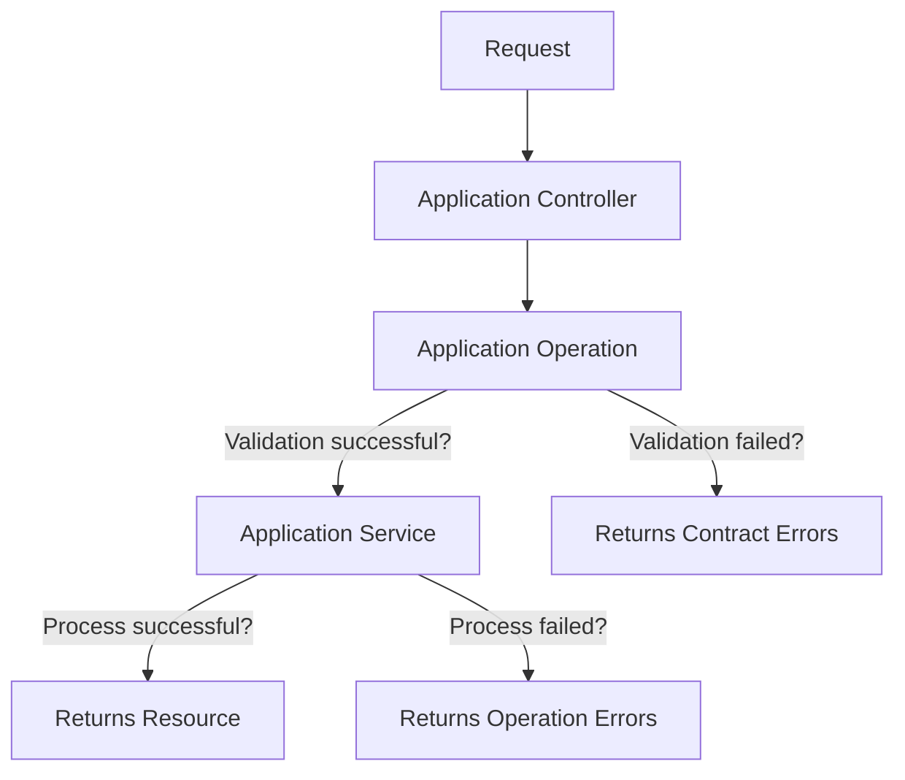

[](https://github.com/rubocop/rubocop)


[](docs/SWAGGER.md)

# Rails API Boilerplate


# How to Works?


# Documentations
- [Swagger](docs/SWAGGER.md)
- [Service generator](docs/SERVICE.md)
- [Contract generator](docs/CONTRACT.md)
- [Search & Filter & Sort](docs/RANSACK.md)

# Installation
## Prerequisites
- [Ruby](https://rvm.io/)
- [PostgreSQL](https://www.postgresql.org/)
- [Redis](https://redis.io/)

## Installation
- Install GEM dependencies:
  ```bash
  bundle install
  ```

- Create database, migrate tables and run the seed data:
  ```bash
  rails db:create
  rails db:migrate
  rails db:seed
  ```

- Then you need to keys of credentials for environments, you can get it from the project manager.

- If you are setting up again, when you already have previous databases:
  ```bash
  rails db:reset
  ```
  `reset` is equivalent of `rails db:drop & rails db:setup`.

-  Run the server
   ```bash
   ./bin/dev
   ```
